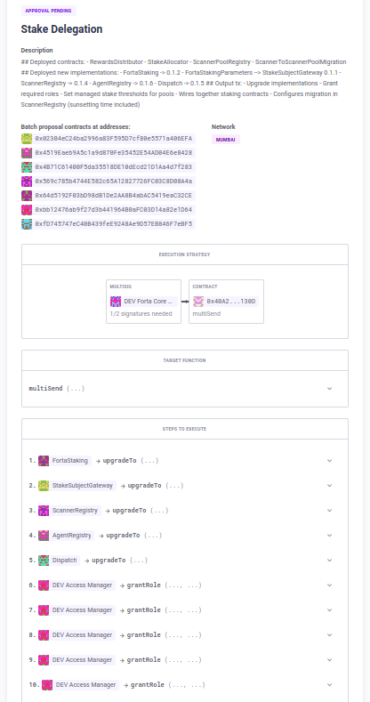

# Smart Contract deployment and admin transaction pipeline.

Based in the concept repo by [Santiago Palladino](https://github.com/spalladino/sample-contract-deploy-pipeline)

Implementation by [Raúl Martínez](https://github.com/Ramarti)

This is smart contract deployment and admin transaction pipeline using Github Actions. The pipeline is composed a set of build, test, deployment, verification, and post-deploy configurable Hardhat tasks and scripts.

In case there are problems with Github, the tasks and config files developed can be triggered locally as well.

This pipeline also serves to propose a list of batched multisig transactions for the Forta Council to sign.


## Why?

Unlike traditional software deployments, contract deployments are usually run by a developer from their local workstation. This is not just a hassle for the developer, but it also hinders transparency and reproducibility of deployments. By moving them to a publicly auditable deployment pipeline, anyone can follow the trace from the source code to a deployed address.

This is especially valuable for protocol stakeholders (from signers to community members) who need to review the deployment or upgrade to a specific version of the code. A stakeholder needs to know if the code deployed matches a specific version, often described by a git tag or commit, that has already been reviewed or even audited. Having a public compilation and deployment pipeline makes it easy to check that the bytecode deployed at a specific address was generated out of a given version of the source code.

For multisig actions in small teams, there are also several risks and errors, like using wrong input data or other human errors when handling the scripts and the poor legibility of batched transactions through Multicall.


## How it works

The release workflow is triggered by pull requests from `release/` branches, and runs on the release branch, not on the merge commit. Each stage in the workflow is set up as a sequential job, which can be mapped to common hardhat tasks or custom scripts.

### Autogenerated summary

The deployment workflow autogenerates a summary with deployment info and relevant links. It will also alert if there is a diff in the contracts between the audited commit and the deployed one, when you supply the optional parameter `audited`

### Build

An initial build job compiles contracts and saves them as artifacts for the following jobs. No other job recompiles contracts, to ensure the same bytecode is preserved throughout the workflow.

### Test

Unit tests are run on the contracts to be released, using `hardhat test`. Other contract test runners could be used as well.

### Prepare

A preparation step parses release info from the user-defined yaml, and outputs an initial release summary. Any diffs with the audited commit are shown here, so the deployment can be halted if needed.

### Deploy

This tasks uses the defined secret `<NETWORK_NAME>_MNEMONIC` or `<NETWORK_NAME>_PRIVATE_KEY` to deploy contracts. Rationale for using a low-security private key is that the deployer account should not have any privileges in the system, and the only risk of leaking it is losing the funds for paying deployment fees. Still, a managed solution such as a [Defender Relay](https://docs.openzeppelin.com/defender/relay) could be used instead.

The deployment script should output the deployed contracts to a `deployed.json` file or `prepared-upgrades.json` in the release folder (under output subfolder), and update a global `release/deployments/<network_id>.json` registry. The provided `deploy` task provides `deployed.json`, `prepare-upgrade` provides `prepared-upgrades.json`, while `deploy-and-prepare-upgrade` does both. Once finished, it commits those changes into the release branch, so once merged, the latest deployment info is kept on the main branch.

### Verify

The verification step is meant to verify source code and artifacts. The provided `verify-deployed` task will read newly deployed contracts out of the `deployed.json` file, and verify source on Etherscan (or XXXScan family of EVM block explorers) and bytecode on Defender. Note that this job can fail, yet the post-deploy step runs anyway. **Verification is separate from deployment** so it can be re-run if needed.

### Post-deploy

The post-deploy job is intended to cover any actions that are meant to be run after the deployment. 

The main use case for this step is the `propose-admin` task, which creates a new batch multisig proposal to upgrade all contracts for which a new implementation was deployed reading `prepared-upgrades.json`, and also batch together multisig transaction interacting with contracts of the repo by parsing `propose-admin.json` config files.

### Upgrade proposal

The upgrade proposal is created in OpenZeppelin Defender:




## How to use

To trigger a new release, create a folder with the version identifier `X.Y(.Z)` in the `releases` folder, with an `index.yml` file with the spec of the release. This includes:

-   `title`: Title of the release
-   `description`: Description of what this release is about.
-   `network`: The network where to deploy, needs to be defined in the hardhat config file
-   `audited`: Optional commit in which the code was audited, used to show the diff with the deployed version
-   `deploy`: Deployment command to execute
-   `verify`: Verification command to execute
-   `finish`: Wrap-up command to execute

All commands are passed to `yarn hardhat`, so any hardhat task can be used, although we recommend to use the predefined tasks explained next.

Example:

```
title: Stake Delegation
network: mumbai
deploy: deploy-and-prepare-upgrade 1.1.0
verify: verify-deployed
finish: propose-admin
description: |
  ## Deployed contracts:
  - RewardsDistributor
  - StakeAllocator
  - ScannerPoolRegistry
  - ScannerToScannerPoolMigration

  ## Deployed new implementations:
  - FortaStaking -> 0.1.2
  - FortaStakingParameters --> StakeSubjectGateway 0.1.1
  - ScannerRegistry -> 0.1.4
  - AgentRegistry -> 0.1.6
  - Dispatch -> 0.1.5

  ## Output tx:
  - Upgrade implementations
  - Grant required roles
  - Set managed stake thresholds for pools
  - Wires together staking contracts
  - Configures migration in ScannerRegistry (sunsetting time included)
```

You also need to create a subfolder with the network name, where the config json files that the tasks consume will be located, and the output files will be written.


### Pre defined Tasks

For simplicity, some tasks are already defined:

-   `deploy-proxy CONTRACT ARG1 ARG2...`: Deploys a contract as upgradeable and initializes it with ARGs
-   `prepare-upgrade CONTRACT1 CONTRACT2`: Deploys new implementations for all CONTRACTs
-   `verify-deployed`: Reads deployed contracts and verifies [source code in Etherscan](https://etherscan.io/verifyContract) and [artifacts in Defender](https://docs.openzeppelin.com/defender/admin#bytecode-verification)
-   `propose-upgrade`: Creates a [batch proposal](https://docs.openzeppelin.com/defender/admin#batches) to simultaneously upgrade all contracts via a multisig in Defender

Alternatively, custom scripts can be used by passing them through hardhat's `run` command. This allows for more complex deployment scripts to be run. See [v1.4/deploy.ts](releases/v1.4/deploy.ts) for an example.

Once the release is defined, create a pull request from the `release/X.Y(.Z)` branch into master. This will trigger the [release](.github/workflows/release.yml) workflow, that includes the build, test, deployment, verification, and post-deploy jobs.

# Folder structure

```
 - <release_version>: use `X.Y(.Z)` for a deployment, a short description for an admin action only.
    - <network_name>: network name, i.e polygon, mainnet, mumbai. It has to be the ones defined in hardhat.config.js
        - config: folder for the json inputs, if needed.
            - deploy.json: Input for the deploy task with info for contracts to be deployed.
            - upgrade.json: Input for the prepare-upgrade task, with implementation contracts info.
            - propose-admin: Input for the propose-admin task, with the methods that the multisig needs to execute in the repo's contract
        - output: folder generated by the tasks
            - deployed: info of the new contracts or proxy + implementation contracts deployed.
            - prepared-upgrades: implementation contracts deployed by oz-upgrades plugin
    - deployments: folder with general info of the contracts deployed in several networks.
        - <network_id>.json : info on the current state of the contracts deployed on the network
        - multisigs.json: info on the admin multisigs on each network
        - relayers.json: info on the (usually) priviledged EOAs needed. Tipically OZ Defender relayers.
```

# Config files for pre-defined tasks

These json files hold the info that the tasks will use to interact with the contracts.

## Parameter substitution

To make the config files less error prone, there are some parameter substitutions allowed:
- `deployment.<contract-key>`: address of a deployed contract/proxy found in `/releases/deployments/<network>.json`. Example `deployment.access-manager`. This could reference contracts being deployed in the same release, as long as they precede this reference in the config file (previous entries).
- `deployment.multisig`: admin multisig address for the network as defined in `/releases/deployments/multisigs.json`.
- `deployment.relayer`: priviledged EOAs (usually OZ Defender Relayers) for the network as defined in `/releases/deployments/relayers.json`.
- `roles.<IDENTIFIER_ROLE>`: keccack256 hash of the identifier of a role, as defined in `Roles.sol` or the Forta token contracts.
- **NOTE:** All parameters must be strings, numbers included, to not trigger overflow errors on BigNumber conversion.

## Deploy and Prepare Upgrades tasks

For deploying and preparing upgrades, they will describe contracts and their deployment parameters.


-   **Non-upgradeable contract**

```
"ContractName": { --> Contract name
    "constructor-args": [
        "0x123...00", "argument", "1" --> arguments for contructor.
    ]
}
```

-   **Upgradeable contract**

```
"ContractName": { --> Contract name
    "impl": { --> Implementation params
        "init-args": [], --> Init arguments.
        "opts": { --> Arguments for oz-upgrades opts field
        }
    }
},
```
See https://docs.openzeppelin.com/upgrades-plugins/1.x/api-hardhat-upgrades#common-options

Example:

```
"Dispatch": {
    "impl": {
        "opts": {
            "unsafe-allow": [
                "delegatecall"
            ],
            "constructor-args": [
                "deployment.forwarder"
            ]
        }
    }
}
```
## Propose Admin task

This task will parse this file and add batched steps to the upgrade multisig transaction. This could be used in a release without deploy steps to just batch multisig actions in an auditable process.


### Secrets

The workflow requires a few secrets to be set in order to run, such as:

-   INFURA_PROJECT_ID
-   MUMBAI_MNEMONIC
-   MUMBAI_NODE
-   POLYGON_MNEMONIC
-   POLYGON_NODE
-   POLYSCAN
-   RELEASE_PATH
-   ARTIFACT_REFERENCE_URL

## License

The release CI/CD related scripts are under the MIT License.
Forta Network contracts are under the [Forta Network License](https://github.com/forta-network/forta-contracts/blob/master/LICENSE.md).

